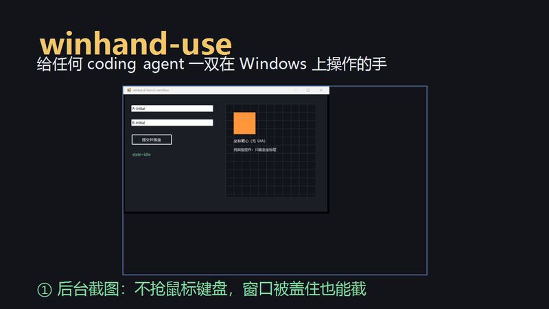

<div align="center">

# winhand-use · Windows Computer-Use Agent Skill

**给任何 coding agent 一双在 Windows 上操作的手**：操控没有 API 的 Windows 原生 App，并把每一步留成可复现的取证。

[](LICENSE)
[](#前置条件)
[](#安装)

> **架构来源**：本项目是 [huashu-mac-use](https://github.com/alchaincyf/huashu-mac-use)（[花叔](https://x.com/AlchainHust)，MIT）的 **Windows 重写版**——
> 沿用原版「四层控制面、读写分离、动作回读取证」的整套架构与心智，把 macOS 内核（Swift + Accessibility）换成 Windows 原生技术栈（Win32 + UIA + PowerShell），`cdp.js` 原样复用。向原作者的优秀设计致谢。

<br/>



</div>

## 它解决什么问题

白领任务的最后一步大多发生在桌面 App 里，而这些 App 常常既没有 API 也没有命令行。这个技能让 agent（Claude Code / Codex / Cursor / Kimi Code / ZCode / Hermes / DeepSeek harness……）按原版三条原则工作：

1. **先探测，再选层**：四层控制面，越往上越省事越稳——L0 结构接口（自带 CLI/COM、CDP、本地端口、URL scheme）→ L1 UIA 语义树（后台读写）→ L2 窗口坐标 → L3 像素截图。
2. **读完全后台，写默认零焦点**：窗口被遮挡也能后台截图（PrintWindow）；UIA 直写、UIA Invoke 触发按钮都不碰焦点；判不出生效才借焦点，且要过四道闸（前台/遮挡/在场/全机焦点锁），借到的那半秒屏幕四角闪橙色取景框。
3. **工具说成功不算数**：动作后自动截图差分 + 读回，回 `effect=confirmed|partial|suspected_noop|unverifiable`；`suspected_noop` 不是失败，是「回去重看」。

## 实测与公开基准

2026-09-07 手工实测：

- 后台窗口截图（被遮挡可截、DPI 物理像素一致）
- UIA 读树 / 后台写入 + 读回一致（含中文无损）
- 端到端沙盒操控：双输入框窗口精确写入指定框 → UIA 触发按钮 → 副作用文件落盘，全程零焦点
- 退出码三态（0/1/2）供 agent 框架判断

2026-09-14 公开基准（Windows 11 26200 / PowerShell 5.1）：

- **10 pass / 0 fail / 1 skip**；跳过项是用户已有记事本进程，避免打扰
- 沙箱场景：`see` / `axset` / `axpress` / 遮挡截图 / `--dry` 预演 / L0 CDP 全链路全部通过
- 真实应用：资源管理器桌面、计算器、画图均通过后台截图 + UIA 可读；另有 opt-in 的真实 Chromium 客户端 CDP 挂载（只统计页面数量，不读内容）
- 常用软件探测：11/12 可解析，5 个 Chromium 系，1 个已开 CDP 端口
- 复现命令与样本：见 [benchmarks/README.md](benchmarks/README.md)，样本报告在 `benchmarks/results/sample/`

## 前置条件

- Windows 10/11
- Windows PowerShell 5.1（系统自带；**不要用 pwsh**，UIA 依赖 .NET Framework）
- Node.js（仅内嵌 Chromium 的 App 走 CDP 时需要）

## 安装

### 方式一：一条命令（推荐）

```powershell
# 装到当前项目（生成 .agents/skills/winhand-use 和 skills-lock.json）
npx skills add zhao-jinping123/winhand-use

# 装到用户级，所有项目可用
npx skills add zhao-jinping123/winhand-use -g
```

支持 Codex / Claude Code / Cursor 等 Agent Skills 运行时；
实测 2026-09-13：仓库能被 `skills` CLI 识别为 1 个 skill 并复制安装成功。

### 方式二：手动克隆

把仓库克隆或复制到目标 runtime 的 skills 目录：

| Runtime | 目录 |
|---|---|
| Codex（项目级） | `.agents/skills/winhand-use` |
| Codex（用户级） | `~/.codex/skills/winhand-use` |
| Claude Code | `~/.claude/skills/winhand-use` |
| Cursor | `~/.cursor/skills/winhand-use` |
| 其它 | 见 `references/多框架适配.md` |

```powershell
git clone https://github.com/zhao-jinping123/winhand-use.git ~/.codex/skills/winhand-use
# 任何 runtime：首次使用先自检
powershell -NoProfile -ExecutionPolicy Bypass -File "$HOME\.codex\skills\winhand-use\scripts\win.ps1" doctor
```

首次运行自动编译 C# 内核到 `scripts\.cache\`，无需手动 build。

## 快速上手

```powershell
# 环境自检（换框架/新机器第一步）
winhand doctor

# 探测某个 app 能不能自动化
probe.cmd 记事本

# 列窗口 / 后台截窗口（不打扰用户）
winhand windows
winhand shot <目标> 输出.png

# 显示/还原目标窗口，但不抢你的前台焦点
winhand show <目标>

# 看界面 + UIA 元素表 → 后台写文本 → 后台触发按钮
winhand see <目标>
winhand axset <目标> e0 "文本"
winhand axpress <目标> e1

# 坐标点击输入（自动后台→借焦点阶梯；先 --dry 预演）
winhand op <目标> 100 200 "文本" @截图.png --dry
```

完整命令表、四层控制面详解、停手线、取证回流规则见 `SKILL.md` 与 `references/`。

内嵌 Chromium 的桌面客户端（微信 4.x / 钉钉 / 豆包 / VS Code 等）优先走 CDP：
接入方式、常见客户端状态和隐私边界见 [references/CDP接入.md](references/CDP接入.md)。
注意：本技能只操作**电脑桌面客户端**，不能控制手机微信/钉钉。

## MCP Server（给 MCP 客户端）

不想装 skill、只想让 Agent 直接调用工具？仓库自带零依赖 MCP Server，
把 18 个 Windows 操控工具通过 stdio 暴露给 Claude Code / Cursor / Codex / Claude Desktop 等客户端：

```powershell
# 自测（initialize → tools/list → tools/call win_doctor）
node mcp\selftest.js
```

Codex 配置（`~/.codex/config.toml`）：

```toml
[mcp_servers.winhand]
command = "node"
args = ["C:/Users/<你>/.codex/skills/winhand-use/mcp/server.js"]
startup_timeout_sec = 60
```

工具列表、Claude/Cursor 配置和超时/输出上限环境变量见 [mcp/README.md](mcp/README.md)。

## 停手线（摘要）

发布/付款/删除/覆盖保存等不可逆动作、终端回车、UAC 弹窗、银行/券商/医疗/政务界面——一律交还用户，不绕。

## 公开基准

`benchmarks/` 里的基准不认工具返回值，只认三件事：读回一致、副作用文件落盘、动作前后前台窗口不变。

```powershell
# 完整基准（沙箱 + 真实应用 + 12 个常用软件探测）
powershell -NoProfile -ExecutionPolicy Bypass -File benchmarks\run.ps1

# 只跑沙箱
powershell -NoProfile -ExecutionPolicy Bypass -File benchmarks\run.ps1 -SkipRealApps -SkipProbe
```

结果输出 `report.json` / `report.md` / 原始截图。当前基准覆盖、场景断言和扩展方法见
[benchmarks/README.md](benchmarks/README.md)。

开发自检（BOM + PowerShell 语法，GitHub Actions 同款）：

```powershell
powershell -NoProfile -ExecutionPolicy Bypass -File scripts\check.ps1
```

## 目录结构

```text
winhand-use/
├── SKILL.md                 # 身份、四层控制面、命令表、停手线、回流规则
├── scripts/
│   ├── win.ps1              # Windows 操控内核（PowerShell + C#：窗口/截图/UIA/事件/四道闸/HUD）
│   ├── winuse.cs.inc        # Win32/UIA 辅助层（自动编译）
│   ├── win.cmd / probe.cmd  # 命令入口
│   ├── probe.ps1            # 第 0 步能力探测
│   └── cdp.js               # 内嵌 Chromium 的 CDP 工具（复用 huashu-mac-use）
├── benchmarks/              # 公开基准：沙箱靶标 + 真实应用场景 + 常用软件探测矩阵
├── assets/                  # demo.gif / demo.mp4 演示素材
├── mcp/                     # 零依赖 MCP Server（18 个工具 + 自测）
└── references/
    ├── 控制面详解.md / 权限与故障.md / app档案.md
    ├── CDP接入.md / 取证规范.md / 踩坑实录.md / 多框架适配.md
```

## 许可

MIT。基于 [huashu-mac-use](https://github.com/alchaincyf/huashu-mac-use)（MIT，Copyright (c) 2026 花叔）改写；`cdp.js` 原样复用。详见 [LICENSE](LICENSE)。
